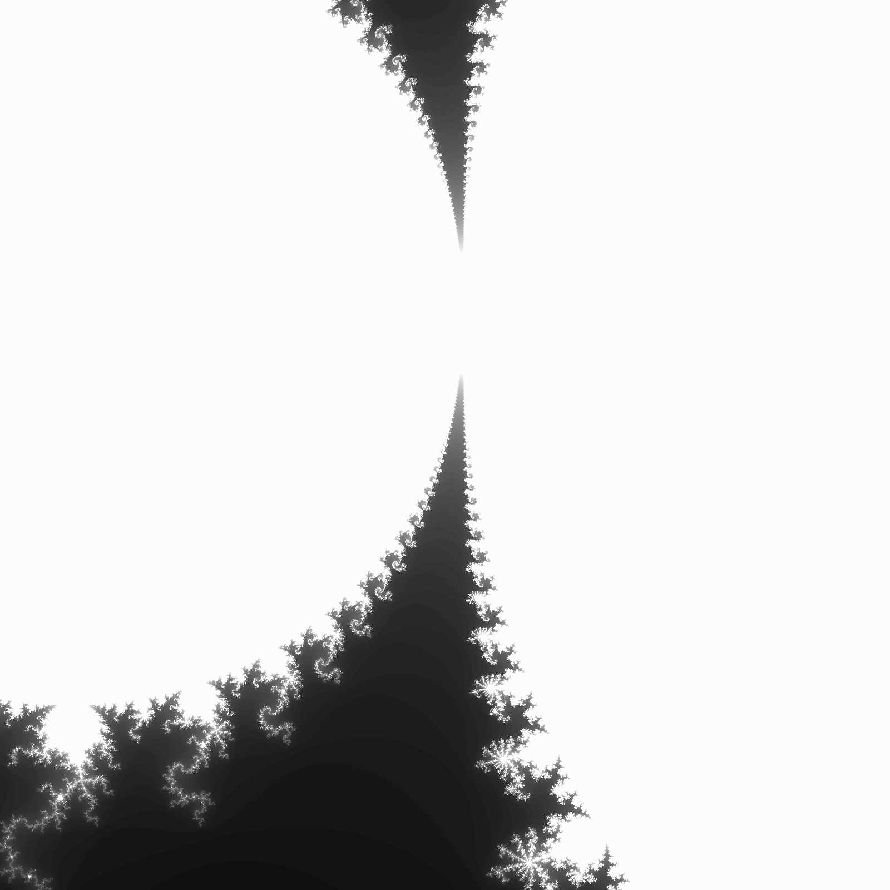
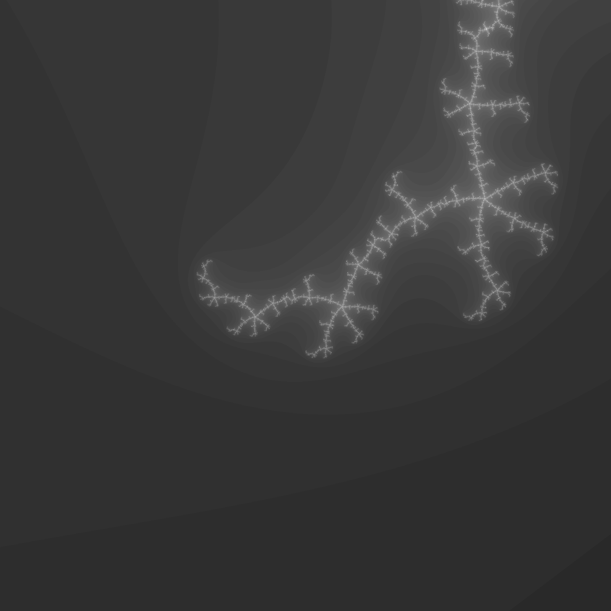
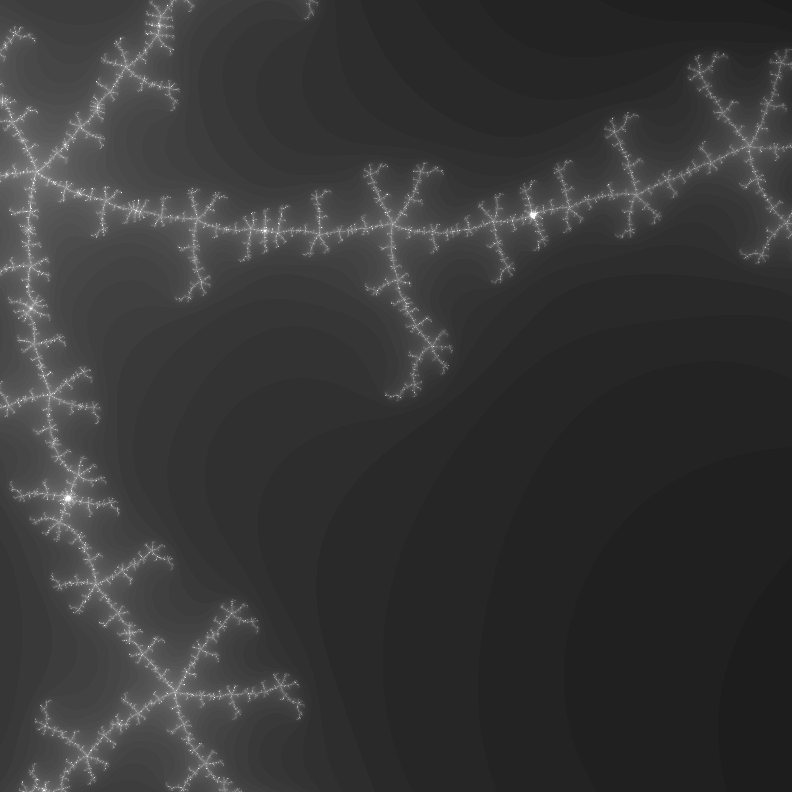
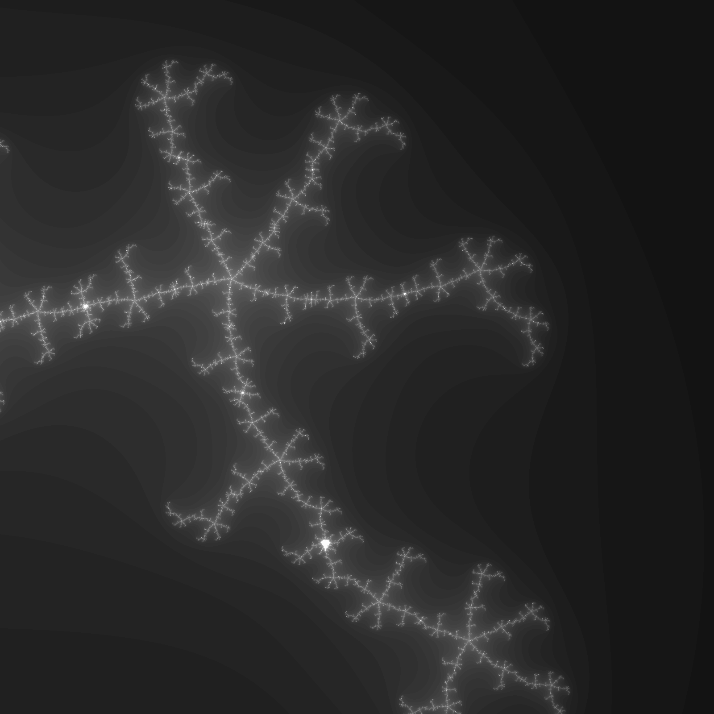
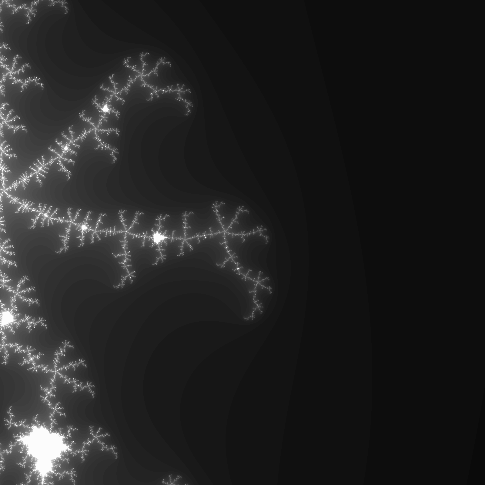
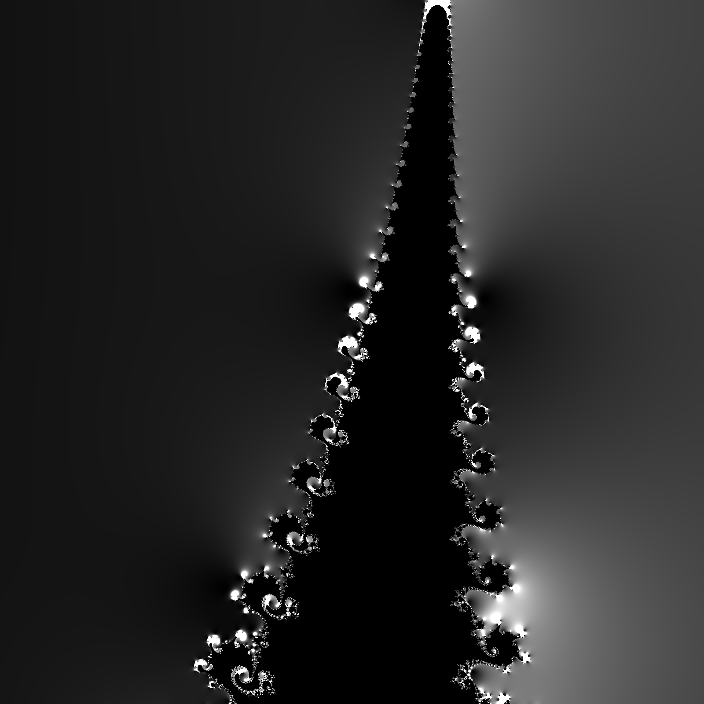
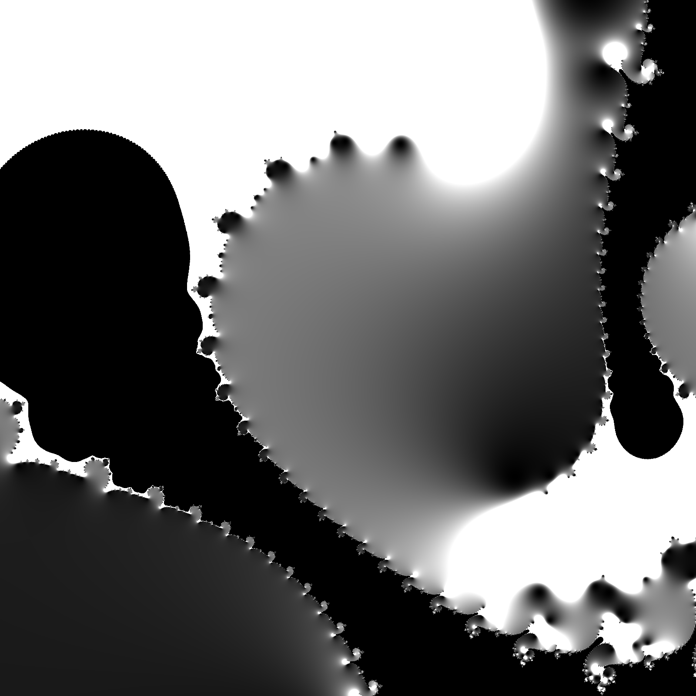
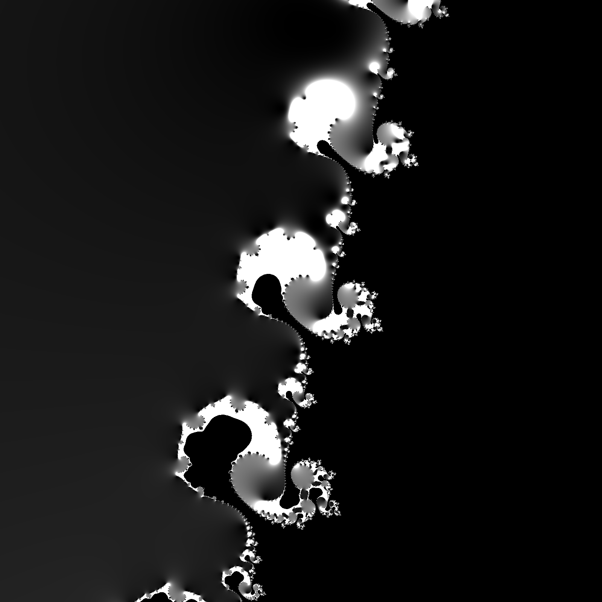
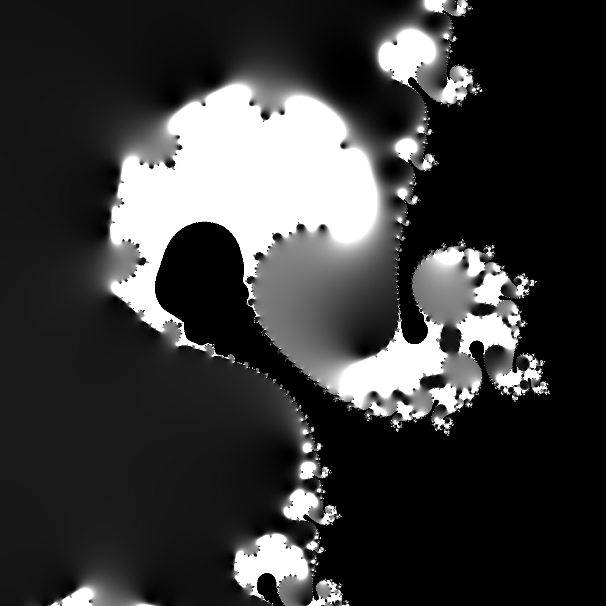
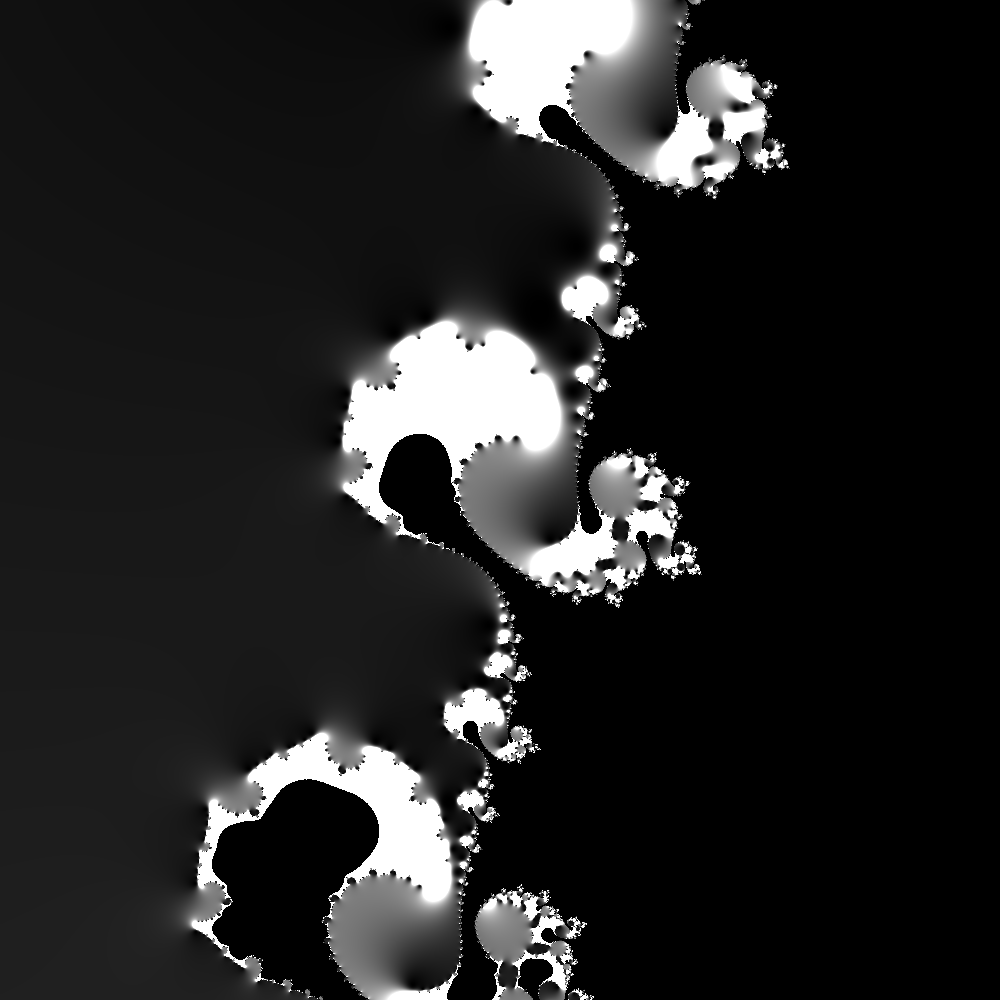

# Fractal-js

Visualize fractal (Mandelbrot set) with javascript.

- `cpu.html` : Use only pure js. Resolution = 500 by 500, iteration = 20.
- `webgl.html` : Use webgl to. Resolution = 2000 by 2000, iteration = 80.

# Results

Below are some interesting results from `webgl.html`.

